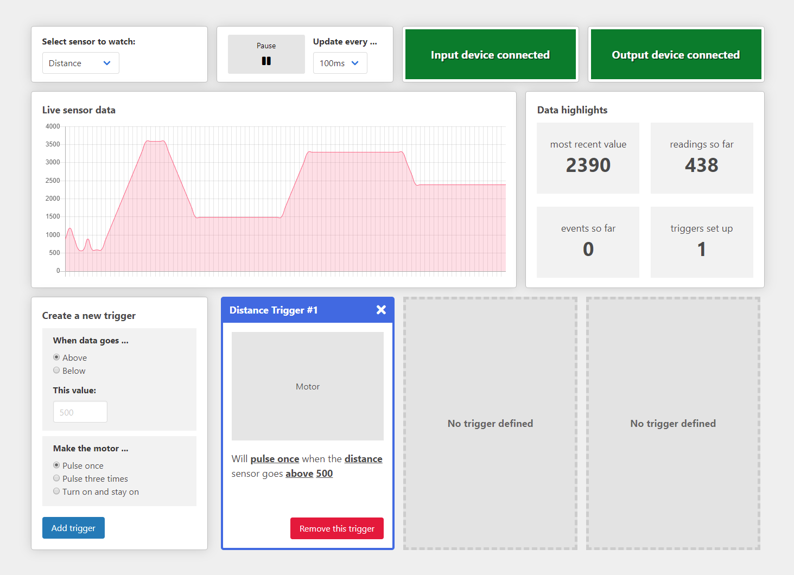

Check out the [documentation page for this project](https://jasonwebb.github.io/dashboard-for-everybody/)!

---

---

**A Dashboard for Everybody** is a small, speculative demo project that shows how real-time dashboards, like those used for IoT systems, can be enhanced using accessible design and development practices.

It is intended to be an educational resource providing accessible solutions for common UI/UX challenges found in dashboards, like dealing with charts, working with asynchronous data, and handling dynamic content.

It was (mostly) built as part of [IoT HackDay 2019](https://www.meetup.com/iotfuse/events/264780943/) in St. Paul, MN by [Jason Webb](https://www.linkedin.com/in/zenwebb/) and [John Haus](https://www.linkedin.com/in/johnhaus/).

## Accessibility features

* **Fully operable** via keyboard
* **Chart data** is available to people using screen readers through visually-hidden tables.
* Important asynchronous information (like the availability of input and output devices) is **announced through live regions**
* All focusable and interactive elements have strong, consistent **focus indicators**
* Meets [WCAG 2.0 (Level AA)](https://www.w3.org/TR/WCAG20/) requirements
* Works great on **mobile devices and tablets**, which are very popular among people with motor and visual conditions

## Technical details

* Vanilla ES6 JavaScript for interactivity, logic, and DOM manipulation
* [Chart.js](https://www.chartjs.org/) for live sensor data charts
* [MQTT.js](https://github.com/mqttjs/MQTT.js) for communication with IoT-enabled input and output devices
* Semantic HTML5
* Light usage of [ARIA](https://www.w3.org/TR/wai-aria-1.1/) based on [WAI-ARIA Authoring Practices](https://www.w3.org/TR/wai-aria-practices-1.1/) and insight from real users
* [Gulp](https://gulpjs.com/)-based build system
* [Sass](https://sass-lang.com/) for styling, organized using the [7-1 pattern](https://sass-guidelin.es/#the-7-1-pattern)

## Local setup and running

See the [README](https://github.com/jasonwebb/dashboard-for-everybody/blob/master/dashboard/README.md) under the `./dashboard` folder for details.

## Sample devices - IoT-enabled sensor platform and motor controller
To demo how the dashboard might be used with real hardware, we built two IoT-enabled devices during IoT Hackday - one to feed data to the dashboard and another to receive data and create physical notifications. The devices and dashboard all communicated over MQTT thanks to the Mosquitto test server. See [this diagram](https://raw.githubusercontent.com/jasonwebb/dashboard-for-everybody/master/media/system-diagram.png) for a breakdown of how the whole system was set up.

### Input device (sensors)

1. Uses [Adafruit Huzzah32 board](https://learn.adafruit.com/adafruit-huzzah32-esp32-feather)
2. Has a [Sharp 2Y0A02](https://www.sparkfun.com/products/8958) infrared distance sensor connected to pin 32
3. Reads sensor data and transmits it to dashboard using MQTT (see `./input-device` for the Arduino sketch)

### Output device (motor controller)

1. Uses [Adafruit Huzzah32 board](https://learn.adafruit.com/adafruit-huzzah32-esp32-feather)
2. Has a hobby DC motor connected to **digital pin 12** via a [L298-based motor controller](https://smile.amazon.com/gp/product/B06XGD5SCB/ref=ppx_yo_dt_b_asin_title_o02_s00?ie=UTF8&psc=1)
3. Controls the motor based on MQTT messages sent from the dashboard (see `./output-device` for the Arduino sketch)

## Demo

